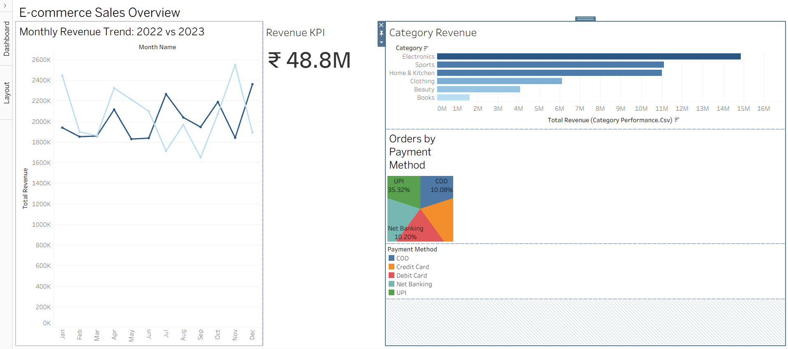
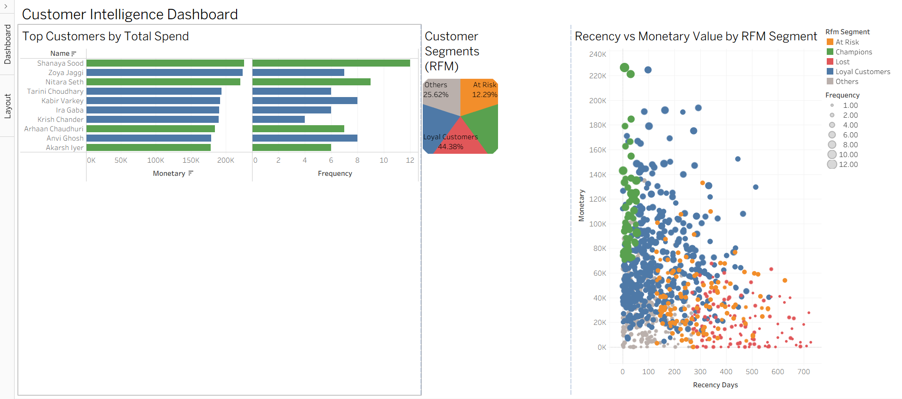
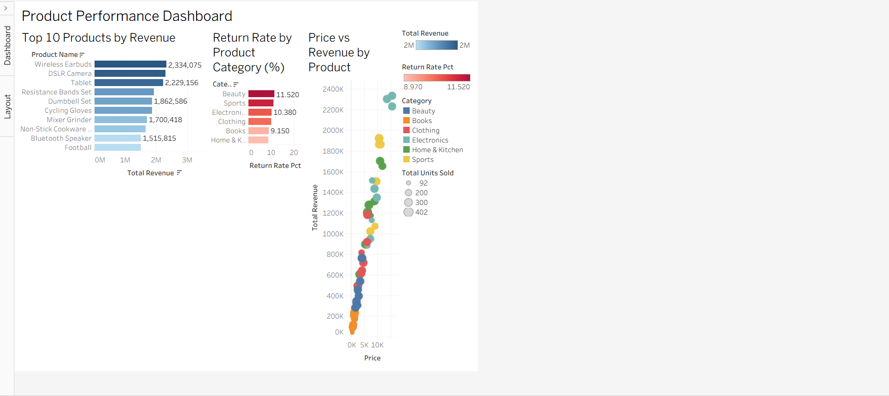
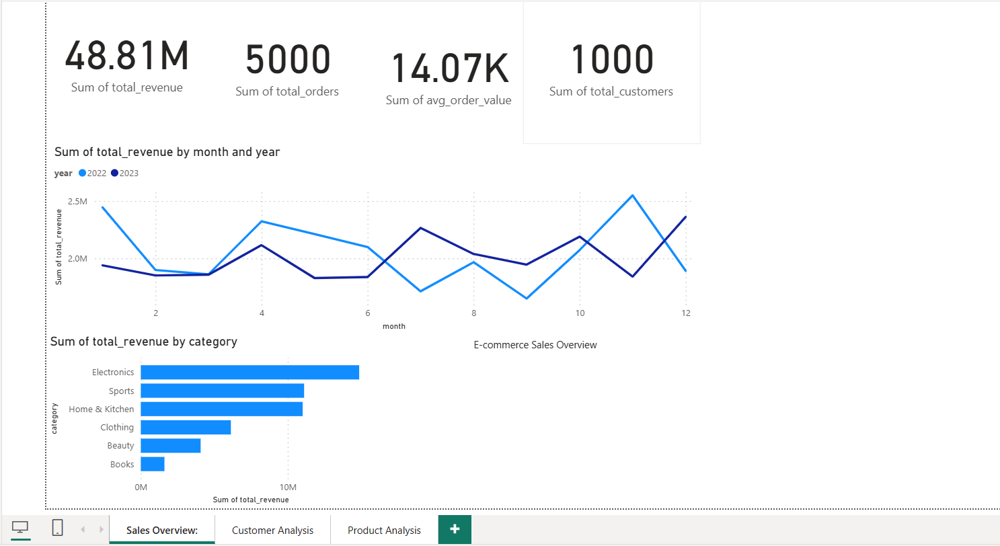
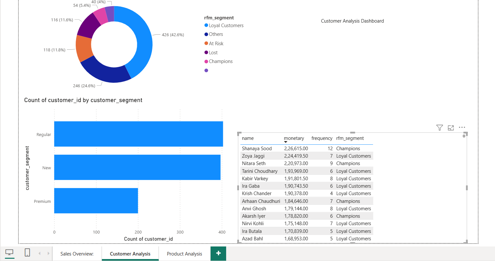
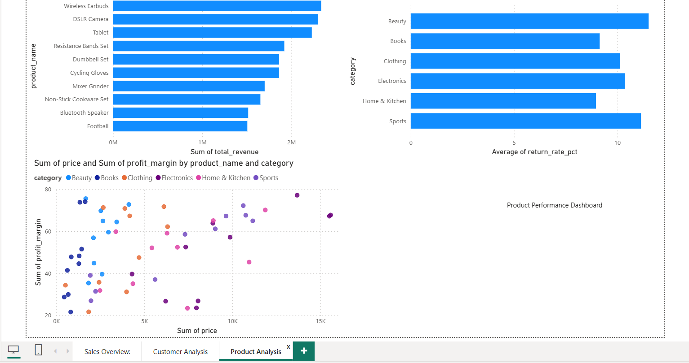

# 🛒 E-Commerce Sales & Customer Behavior Analysis

> An end-to-end data analytics portfolio project — from synthetic data generation to
> interactive dashboards — analysing **14,100 records** across **1,000 customers**,
> **100 products**, and **5,000 orders** spanning **January 2022 to January 2024**,
> with deep focus on revenue trends, RFM segmentation, and product performance.

---

## 📌 Table of Contents
1. [Project Overview](#-project-overview)
2. [Tools & Technologies](#-tools--technologies)
3. [Architecture](#-architecture)
4. [Folder Structure](#-folder-structure)
5. [How to Run](#-how-to-run)
6. [Key Findings](#-key-findings)
7. [Dashboard Screenshots](#-dashboard-screenshots)
8. [SQL Highlights](#-sql-highlights)
9. [Dataset Details](#-dataset-details)
10. [Author](#-author)

---

## 🔍 Project Overview

This project performs a complete end-to-end e-commerce data analysis using a
synthetic Indian e-commerce dataset generated with Faker and NumPy. The pipeline
generates, cleans, transforms, and loads data into a SQLite database, then
visualizes insights through Matplotlib/Seaborn, Tableau, and Power BI dashboards.

| Stage | Tool | What Happens |
|-------|------|-------------|
| **Generation** | `generate_data.py` | Creates 14,100 rows of realistic Indian e-commerce data |
| **Cleaning** | `data_cleaning.py` | 9-step Pandas pipeline, RFM scoring, feature engineering |
| **Analysis** | `eda_analysis.py` | 8 publication-quality plots + 4 SQL queries |
| **Storage** | SQLAlchemy + SQLite | Bulk load into SQLite database |
| **SQL** | `queries.sql` | 8 queries: revenue trends, top products, return rates |
| **Visualization** | Tableau + Power BI | 3 interactive dashboards each |
| **EDA** | Jupyter Notebook | Fully executed notebook with inline charts |

---

## 🛠 Tools & Technologies

| Tool | Version | Purpose |
|------|---------|---------|
| Python | 3.12 | Core language |
| Pandas | 2.1.4 | Data manipulation & preprocessing |
| NumPy | 1.26.2 | Numerical computations |
| Matplotlib | 3.8.2 | Static chart generation |
| Seaborn | 0.13.0 | Statistical visualizations |
| Scikit-learn | 1.3.2 | KMeans clustering, preprocessing |
| SQLAlchemy | 2.0.23 | ORM & SQL query execution |
| SQLite | built-in | Lightweight relational database |
| Faker | 20.1.0 | Synthetic data generation (Indian locale) |
| openpyxl | 3.1.2 | Excel export support |
| Jupyter | 1.0.0 | Interactive notebook analysis |
| Tableau Desktop | — | 3 interactive sales dashboards |
| Power BI Desktop | — | 3 interactive BI dashboard pages |

---

## 🏗 Architecture

```
+--------------------------------------------------+
|              DATA GENERATION                     |
|   Faker + NumPy (seed=42, Indian locale)         |
|   14,100 rows . 4 tables . Jan2022-Jan2024       |
+--------------------------------------------------+
                         |
                         v
+--------------------------------------------------+
|        PYTHON ETL PIPELINE (scripts/)            |
|                                                  |
| generate_data.py    ->  Generate + validate      |
| data_cleaning.py    ->  Clean + RFM scoring      |
| eda_analysis.py     ->  8 plots + SQL queries    |
| dashboard_export.py ->  6 BI-ready CSV exports   |
+--------------------------------------------------+
                         |
                         v
+--------------------------------------------------+
|         SQLITE DATABASE (ecommerce.db)           |
|                                                  |
| customers      (1,000 rows)                      |
| products       (100 rows)                        |
| orders         (5,000 rows)                      |
| order_items    (8,000 rows)                      |
| 8 SQL Analysis Queries                           |
+-------------------+------------------------------+
                    |
          +---------+---------+
          |                   |
          v                   v
+------------------+  +--------------------------------+
| JUPYTER          |  | BI LAYER                       |
| NOTEBOOK         |  |                                |
|                  |  | Tableau Desktop                |
| Executed EDA     |  | Dashboard 1: Sales Overview    |
| Inline charts    |  | Dashboard 2: Customer Intel    |
| RFM analysis     |  | Dashboard 3: Product Perf      |
|                  |  |                                |
|                  |  | Power BI Desktop               |
|                  |  | Page 1: Sales Overview         |
|                  |  | Page 2: Customer Analysis      |
|                  |  | Page 3: Product Performance    |
+------------------+  +--------------------------------+
```

---

## 📁 Folder Structure

```
ecommerce-sales-analysis/
|
|-- requirements.txt                    # All Python dependencies
|-- README.md                           # Project documentation
|-- .gitignore                          # Git exclusion rules
|-- setup.sh                            # Mac/Linux environment setup
|-- setup.bat                           # Windows environment setup
|
|-- scripts/                            # Python pipeline scripts
|   |-- generate_data.py                # Step 1 - Synthetic data generation
|   |-- data_cleaning.py                # Step 2 - Cleaning + RFM scoring
|   |-- eda_analysis.py                 # Step 3 - EDA + 8 visualizations
|   `-- dashboard_export.py             # Step 4 - BI-ready CSV exports
|
|-- sql/                                # SQL files
|   `-- queries.sql                     # 8 business analysis queries
|
|-- notebooks/
|   `-- ecommerce_analysis.ipynb        # Fully executed EDA notebook
|
|-- dashboards/
|   `-- DASHBOARD_GUIDE.md             # Tableau + Power BI build guide
|
|-- data/
|   |-- raw/                            # Original generated data
|   |   |-- customers.csv              # 1,000 customers (Indian locale)
|   |   |-- products.csv               # 100 products across 6 categories
|   |   |-- orders.csv                 # 5,000 orders (2022-2024)
|   |   |-- order_items.csv            # 8,000 order line items
|   |   `-- ecommerce.db               # SQLite DB (all 4 tables loaded)
|   |
|   `-- processed/                      # Cleaned & feature-engineered data
|       |-- customers_clean.csv        # + tenure_days column
|       |-- products_clean.csv         # + profit_margin column
|       |-- orders_clean.csv           # + year/month/quarter/weekday
|       |-- order_items_clean.csv      # + recalculated total_price
|       |-- rfm_scores.csv             # RFM scores + segment labels
|       |
|       `-- dashboard_exports/          # Tableau & Power BI ready files
|           |-- kpi_summary.csv        # 1-row KPI snapshot for cards
|           |-- monthly_revenue.csv    # Year-month revenue trend
|           |-- category_performance.csv
|           |-- customer_segments.csv  # Customers merged with RFM
|           |-- product_performance.csv
|           `-- daily_orders.csv       # Gap-filled daily orders (731 rows)
|
`-- outputs/
    `-- plots/                          # All chart outputs (PNG, 150 DPI)
        |-- top_products_revenue.png
        |-- monthly_revenue_trend.png
        |-- revenue_by_category.png
        |-- orders_by_payment_method.png
        |-- customer_segment_distribution.png
        |-- rfm_segment_distribution.png
        |-- weekly_order_trend.png
        |-- category_return_rate.png
        |-- dashboard_sales_overview.png
        |-- dashboard_customer_intelligence.png
        |-- dashboard_product_performance.png
        |-- powerbi_sales_overview.png
        |-- powerbi_customer_analysis.png
        `-- powerbi_product_performance.png
```

---

## ▶ How to Run

### Prerequisites
- Python 3.11+
- Tableau Desktop (for Tableau dashboards)
- Power BI Desktop (for Power BI dashboards)

### Step 1 — Clone Repository
```bash
git clone https://github.com/manoharpothireddy/ecommerce-sales-analysis.git
cd ecommerce-sales-analysis
```

### Step 2 — Create Virtual Environment

**Windows:**
```bat
setup.bat
```

**macOS / Linux:**
```bash
chmod +x setup.sh && ./setup.sh
```

### Step 3 — Run Full Pipeline
```bash
# Step 1 -- Generate 14,100 rows of synthetic data + SQLite DB
python scripts/generate_data.py

# Step 2 -- Clean all tables, add feature columns, compute RFM scores
python scripts/data_cleaning.py

# Step 3 -- Generate 8 EDA plots + run 4 SQL queries
python scripts/eda_analysis.py

# Step 4 -- Export 6 dashboard-ready CSVs for Tableau / Power BI
python scripts/dashboard_export.py
```

Expected output:

```
[OK] Data generation complete. 4 tables saved to data/raw/
[OK] Cleaning complete. Files saved to data/processed/
[OK] EDA complete. 8 plots saved to outputs/plots/
[OK] Dashboard exports complete. 6 files saved to dashboard_exports/
```

### Step 4 — Launch Jupyter Notebook (Optional)
```bash
jupyter notebook notebooks/ecommerce_analysis.ipynb
```

### Step 5 — Connect to Tableau / Power BI
1. Open Tableau Desktop or Power BI Desktop
2. Connect to files in `data/processed/dashboard_exports/`
3. Follow the guide in `dashboards/DASHBOARD_GUIDE.md`

---

## 📊 Key Findings

### 💰 Revenue Overview

| KPI | Value |
|-----|-------|
| Total Revenue | ₹4.88 Cr (delivered orders only) |
| Total Orders | 5,000 |
| Delivered Orders | 3,470 (69.4%) |
| Return Rate | ~10.1% overall |
| Avg Order Value | ₹14,067 |
| Total Customers | 1,000 |

### 🏆 Category Performance

| Category | Revenue | Share |
|----------|---------|-------|
| Electronics | ₹1.49 Cr | 21.0% |
| Sports | ₹1.11 Cr | 15.7% |
| Home & Kitchen | ₹1.10 Cr | 15.5% |
| Clothing | ₹0.61 Cr | 8.7% |
| Beauty | ₹0.41 Cr | 5.7% |
| Books | ₹0.16 Cr | 2.3% |

### 💳 Payment Methods

| Method | Orders | Share |
|--------|--------|-------|
| UPI | 1,766 | 35.3% |
| Credit Card | 1,240 | 24.8% |
| Debit Card | 980 | 19.6% |
| Net Banking | 510 | 10.2% |
| COD | 504 | 10.1% |

### 👥 RFM Customer Segments

| Segment | Count | % | Avg Spend | Avg Orders |
|---------|-------|---|-----------|------------|
| Loyal Customers | 426 | 44.4% | ₹65,997 | 4.7 |
| Others | 246 | 25.6% | ₹31,845 | 2.3 |
| At Risk | 118 | 12.3% | ₹39,141 | 2.9 |
| Lost | 116 | 12.1% | ₹19,766 | 1.5 |
| Champions | 54 | 5.6% | ₹1,10,257 | 6.8 |

### 🌟 Notable Insights

- 📅 **Peak AOV Month:** November 2022 — ₹21,608 average order value
- 🥇 **Top Customer:** Shanaya Sood (Premium, Pune) — ₹2,26,615 across 11 orders
- 🏅 **Top Product:** Wireless Earbuds — ₹23,34,075 total revenue
- 🏆 **Champions (5.6%)** drive disproportionately high spend at ₹1.1 Lakh each
- 📉 **Lost segment (12.1%)** hasn't ordered in 447 days — prime re-engagement targets
- 💡 **Beauty** has the highest return rate at 11.52% — needs product quality review

---

## 📸 Dashboard Screenshots

### Tableau — Sales Overview Dashboard


### Tableau — Customer Intelligence Dashboard


### Tableau — Product Performance Dashboard


### Power BI — Sales Overview


### Power BI — Customer Analysis


### Power BI — Product Performance


---

## 🗂 SQL Highlights

### 8 Business SQL Queries in `sql/queries.sql`

| # | Query | Technique |
|---|-------|-----------|
| 1 | Top 10 best-selling products by revenue | GROUP BY + ORDER BY |
| 2 | Monthly revenue trend for 2022 and 2023 | strftime + GROUP BY |
| 3 | Revenue by product category with share % | SUM + ROUND |
| 4 | Customer count by segment | GROUP BY + COUNT |
| 5 | Top 10 customers by total spend | JOIN + GROUP BY |
| 6 | Orders by payment method with status breakdown | CASE WHEN |
| 7 | Return rate by product category | CAST + ROUND |
| 8 | Average order value by month | AVG + strftime |

### Key SQL Techniques Used

```sql
-- 1. Revenue by category with percentage share
SELECT p.category,
       SUM(oi.total_price) as total_revenue,
       ROUND(SUM(oi.total_price) * 100.0 /
             (SELECT SUM(total_price) FROM order_items), 2) as share_pct
FROM order_items oi
JOIN products p ON oi.product_id = p.product_id
GROUP BY p.category
ORDER BY total_revenue DESC;

-- 2. Return rate by category
SELECT p.category,
       ROUND(CAST(SUM(CASE WHEN o.status = 'Returned'
             THEN 1 ELSE 0 END) AS FLOAT) /
             COUNT(*) * 100, 2) as return_rate_pct
FROM orders o
JOIN order_items oi ON o.order_id = oi.order_id
JOIN products p ON oi.product_id = p.product_id
GROUP BY p.category
ORDER BY return_rate_pct DESC;

-- 3. Top customers by total spend
SELECT c.customer_id, c.name, c.customer_segment,
       SUM(oi.total_price) as total_spend,
       COUNT(DISTINCT o.order_id) as total_orders
FROM customers c
JOIN orders o ON c.customer_id = o.customer_id
JOIN order_items oi ON o.order_id = oi.order_id
WHERE o.status = 'Delivered'
GROUP BY c.customer_id
ORDER BY total_spend DESC
LIMIT 10;
```

---

## 📋 Dataset Details

| Item | Detail |
|------|--------|
| **Type** | Fully synthetic (generated with Faker + NumPy) |
| **Locale** | Indian (names, cities, states) |
| **Seed** | 42 (fully reproducible) |
| **Customers** | 1,000 rows |
| **Products** | 100 rows across 6 categories |
| **Orders** | 5,000 rows (2022–2024) |
| **Order Items** | 8,000 rows |
| **Total Records** | 14,100 rows |

---

## 👤 Author

**P Manohar Reddy**
- GitHub: [@manoharpothireddy](https://github.com/manoharpothireddy)
- LinkedIn: [Manohar Reddy Pothireddy](https://www.linkedin.com/in/manohar-reddy-pothireddy-3ab1a7319/)
- Email: p.manoharreddy789809@gmail.com

---

*Built as a portfolio project demonstrating end-to-end data analytics skills
using Python, SQL, SQLite, Tableau, and Power BI.*
